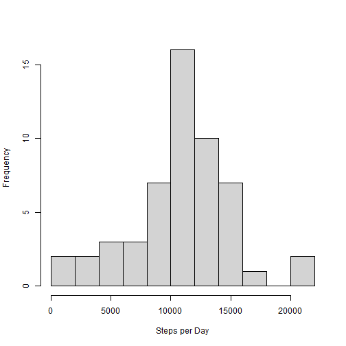
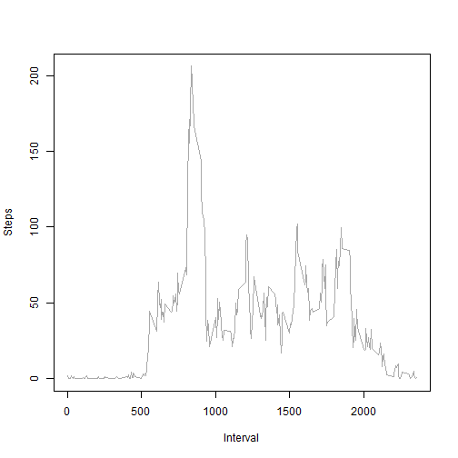
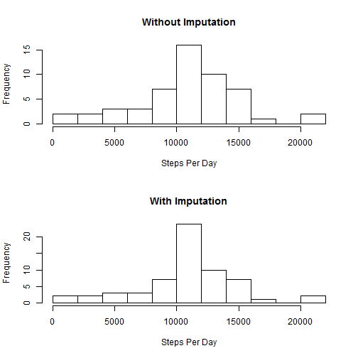
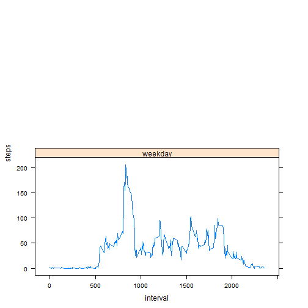

Reproducible Research: Peer Assessment 1
========================================================

This file comtains data from a personal activity monitoring device. The data are collected from the device at 5 minute intervals through out the day. The data consists of two months of data from an anonymous individual collected during the months of October and November, 2012 and include the number of steps taken in 5 minute intervals each day.

*The aim of this documentation is to intrepet in the analysed data and illustrate the visualize information in a literated format using R markdown.* 


## Loading and preprocessing the data


```r

# Set working directory and read in data
setwd("C:/Users/HP/RR_Asgm1/")

data <- read.csv("activity.csv")
# Format the date
data$date <- as.Date(data$date, format = "%Y-%m-%d")
totalrow <- nrow(data)
```

There are a total of **17568** rows of data in our observation.


## What is mean total number of steps taken per day?
Sum up a total number steps taken each day 

```r
StepsADay <- aggregate(data$steps ~ data$date, FUN = "sum")
colnames(StepsADay) <- c("date", "steps")
```

--------------------------------------------------
- HISTOGRAM

```r
par(mfrow = c(1, 1))
hist(StepsADay$steps, main = "", xlab = "Steps per Day", col = "light grey", 
    breaks = 10)
```

 

- DATA SUMMARY

```r
summary(StepsADay)
```

```
##       date                steps      
##  Min.   :2012-10-02   Min.   :   41  
##  1st Qu.:2012-10-16   1st Qu.: 8841  
##  Median :2012-10-29   Median :10765  
##  Mean   :2012-10-30   Mean   :10766  
##  3rd Qu.:2012-11-16   3rd Qu.:13294  
##  Max.   :2012-11-29   Max.   :21194
```


The *mean* total number of steps taken per day is **10766**.

The *median* total number of steps taken per day is **10765**.


## What is the average daily activity pattern?
Mean steps per interval

```r
mSteps <- aggregate(steps ~ interval, data = data, FUN = mean)
```

- TIME SERIES PATTERN

```r
plot(mSteps$interval, mSteps$steps, xlab = "Interval", ylab = "Steps", type = "l", 
    col = "dark grey")
```

 


5-minute interval containing the maximum number of steps across all the days in the dataset

```r
mSteps$interval[which.max(mSteps$steps)]
```

```
## [1] 835
```


## Imputing missing values
Total number of missing values

```r
sum(is.na(data$steps))
```

```
## [1] 2304
```

There are **2304** missing values.

-------------------------------------------------
Filling NA values with the mean value for that 5 minute interval

```r
data.fill <- data

for (i in 1:nrow(data.fill)) {
    if (is.na(data.fill[i, ]$steps)) {
        data.fill[i, ]$steps <- mSteps[mSteps$interval == data.fill[i, ]$interval, 
            ]$steps
    }
}

sum(is.na(data.fill$steps))
```

```
## [1] 0
```


-----------------------------------------------
- COMPARE

```r
StepsADay.new <- aggregate(steps ~ date, data = data.fill, FUN = sum)
par(mfrow = c(2, 1))
hist(StepsADay$steps, breaks = 10, main = "Without Imputation", xlab = "Steps Per Day")
hist(StepsADay.new$steps, breaks = 10, main = "With Imputation", xlab = "Steps Per Day")
```

 


## Are there differences in activity patterns between weekdays and weekends?

```r
data.fill$day <- weekdays(as.Date(data.fill$date))

for (i in 1:nrow(data.fill)) {
    if (data.fill[i, ]$day %in% c("Saturday", "Sunday")) {
        data.fill[i, ]$day <- "weekend"
    } else {
        data.fill[i, ]$day <- "weekday"
    }
}

data.fill$day <- as.factor(data.fill$day)
```

- Plot

```r
mSteps.new <- aggregate(steps ~ interval + day, data = data.fill, FUN = mean)

library(lattice)
xyplot(steps ~ interval | day, data = mSteps.new, type = "l", layout = c(1, 
    2))
```

 

